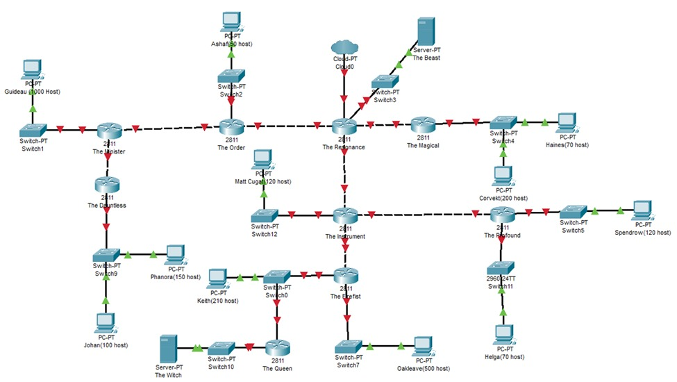
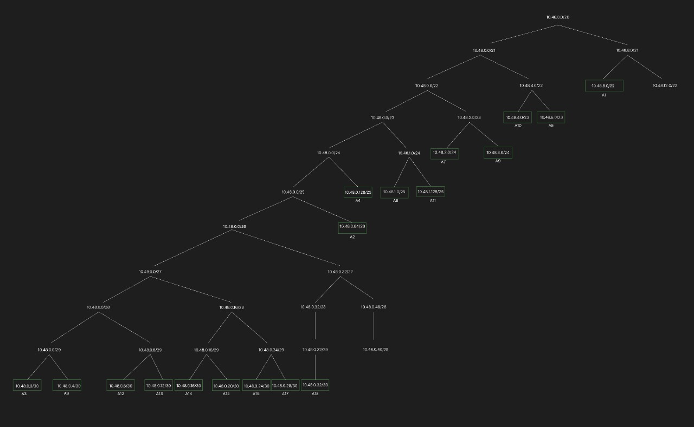
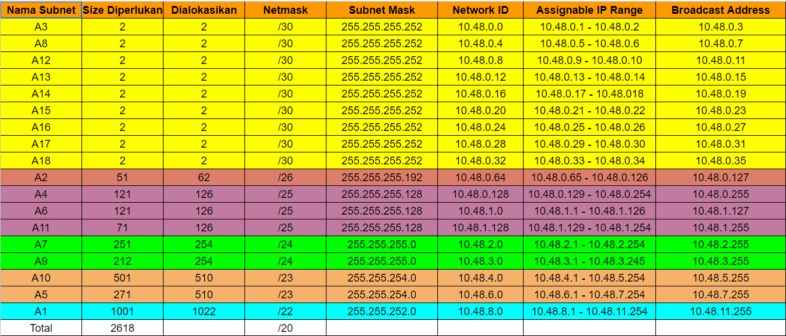
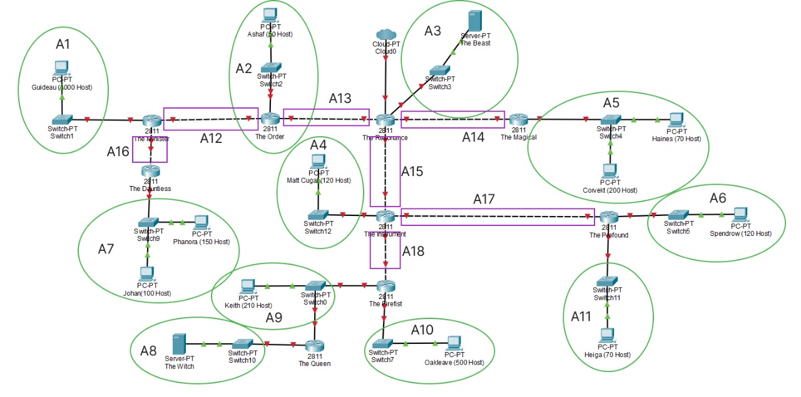

# Jarkom-Modul-4-ITB07-2022
### Laporan Resmi Pengerjaan Sesi Lab Jaringan Komputer 

#### Nama Anggota Kelompok :      
1. 5027201004 Alda Risma Harjian 
2. 5027201042 Ilham Muhammad Sakti 
3. 5027201067 Naufal Ramadhan 

## Jawaban Modul 
## Soal

1. Soal shift dikerjakan pada Cisco Packet Tracer dan GNS3 menggunakan metode perhitungan CLASSLESS yang berbeda.
2. Keterangan: Bila di CPT menggunakan VLSM, maka di GNS3 menggunakan CIDR atau Sebaliknya
3. Jika tidak ada pemberitahuan revisi soal dari asisten, berarti semua soal BERSIFAT BENAR dan DAPAT DIKERJAKAN.
4. Untuk di GNS3 CLOUD merupakan NAT1 jangan sampai salah agar bisa terkoneksi internet.
5. Pembagian IP menggunakan Prefix IP yang telah ditentukan pada modul pengenalan
6. Pembagian IP dan routing harus SE-EFISIEN MUNGKIN.

## Jawaban
### Metode VLSM
Hal pertama yang kami lakukan adalah dengan menentukan subnet yang ada pada topologi. Dikarenakan metode yang dipakai adalah VLSM. Kami melingkari tiap host yang terhubung pada interface router dan menghitung IP yang dibutuhkan. Berikut merupakan gambaran pembagian subnetnya

Setelah melakukan pembagian subnet, langkah selanjutnya melakukan perhitungan untuk pembagian IPnya.

Lalu langkah selanjutnya setelah perhitungan yaitu membuat tree. Berikut merupakan tree yang telah kami buat:

Setelah perhitungan dan tree telah selesai dibuat. Langkah selanjutnya yaitu melakukan konfigurasi pada packet tracer, seperti gambar dibawah ini

